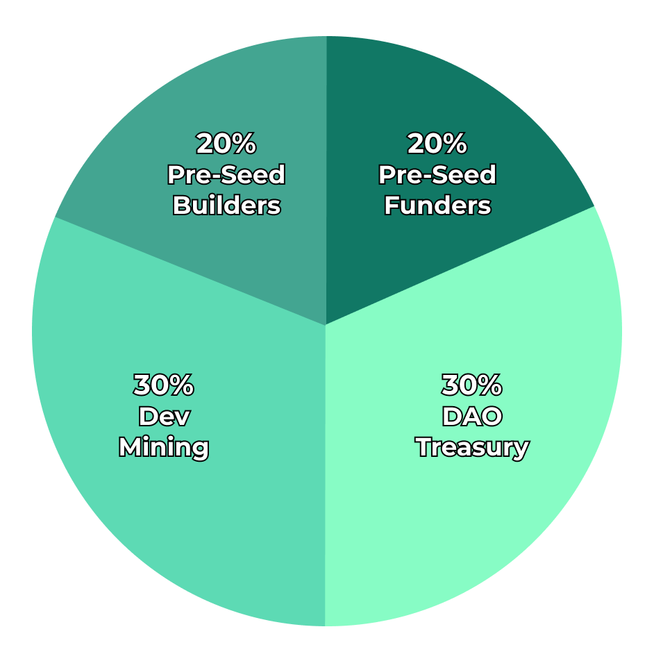

# **Web3API DAO**

 

The `Web3API` token holders, known collectively as the "DAO", are responsible for stewarding the Web3API ecosystem. The DAO controls the:

- Treasury
- Token minting
- DAO configuration
- ENS domain (web3api.eth)

In the future, it is anticipated that the DAO will also govern:

- Web3API repositories
- Web3Hub platform deployments
- DAO-verified APIs (hosted at web3api.eth subdomains)

## **Join The DAO**

Interested in getting involved?

1. Start out by joining our [Discord](https://discord.gg/Z5m88a5qWu) or reaching out to the point person for your area of interest:

| Domain                                                                                                        | Points of Contact |
| ------------------------------------------------------------------------------------------------------------- | ----------------- |
| [Toolchain](https://github.com/Web3-API/prototype)                                                            | dOrgJelli         |
| [Standard](https://github.com/Web3-API/specification)                                                         | Belma, dOrgJelli  |
| [Hub](https://github.com/Web3-API/web3hub)                                                                    | kachette          |
| [Landing Page](https://github.com/Web3-API/landing-page) and [Branding](https://github.com/Web3-API/branding) | Media             |
| [Twitter](https://twitter.com/web3api) and [Substack](https://web3api.substack.com/)                          | Ingalandia        |
| Launch Partners & Dev Relations                                                                               | keeevin           |

2. Submit a proposal on [snapshot](https://snapshot.page/#/web3-api) using our [template](./spending-proposals/000-TEMPLATE.md) and compensation guidelines (below).

3. If your proposal is accepted, add the details [here](./spending-proposals/) and make sure to update this with details as you progress (you are also encouraged to regularly share updates in community chats and calls).

4. Submit payment proposals on [Aragon](https://client.aragon.org/#/w3api) at the delivery milestones laid out in your proposal.

### **Q1 2021 Compensation Guidelines**

Here are guidelines for making your spending proposals. Please keep in mind that all final decisions must be approved by the DAO.

Choose an hourly rate commensurate with your level of relevant experience and desired weighting between USD and `W3API`.

| Level        | Years of Experience | Option 1          | Option 2           | Option 3           | Option 4          |
| ------------ | ------------------- | ----------------- | ------------------ | ------------------ | ----------------- |
| Junior       | 0-2                 | 0.05 `W3API`, $50 | 0.125 `W3API`, $35 | 0.225 `W3API`, $20 | 0.375 `W3API`, $0 |
| Intermediate | 2-4                 | 0.06 `W3API`, $65 | 0.15 `W3API`, $50  | 0.27 `W3API`, $35  | 0.45 `W3API`, $0  |
| Senior       | 4+                  | 0.07 `W3API`, $80 | 0.175 `W3API`, $65 | 0.315 `W3API`, $50 | 0.525 `W3API`, $0 |

### **Web3API DAO Dashboard**

Before submitting a proposal, please take a look at our [**Web3API DAO Dashboard**](https://docs.google.com/spreadsheets/d/1lLnMQpFiYuXlzc52gFSLk0Q4y_W9zPXh-CZpDTZd0Ug/edit?usp=sharing). It will show you:

- Our current cash balance
- Current month budget and next month's budget
- All previously accepted proposals
- Current token holders

> Check to see that your proposal fits within our budget for the month. If it doesn't please feel free to submit for the following month, or message one of the DAO members above on our Discord!

### **W3API Token Spending Projections**

Here is the projected W3API token spending that token holders should consider when drafting and passing spending proposals. These are projections that are subject to change.

| Period | `W3API`           |           |
| ------ | ----------------- | --------- |
| Q4-20  | 828.969           | actual    |
| Q1-21  | ~~970~~ 703.95475 | actual    |
| Q2-21  | 1,353             | projected |
| Q3-21  | 1,392             | projected |
| Q4-21  | 1,456             | projected |
| TOTAL  | 6,000             |           |

## **Token Distribution**

> NOTE: Tokens are initially set to be non-transferable.

- **Dev Mining** (6,000) - Software and business development efforts from Oct 1, 2020 - Dec 31, 2021 (view spending projections above)
- **Pre-Seed Builders** (4,000) - Building efforts before Oct 1, 2020 (viewable [here](./token-allocations/pre-seed-builders.csv))
- **Pre-Seed Funders** (4,000) - Early financial backers (viewable [here](./token-allocations/pre-seed-funders.csv))
- **DAO Treasury** (6,000) - Surplus resource for future usage (integration grants, partnerships, fundraising, insurance, liquidity, etc.)

\* _Please keep in mind that the DAO can decide to change these plans at any time_

## **DAO Configuration**

Initial governance parameters are as follows:
| Parameter | Value | Description |
|-|-|-|
| _Minimum Approval_ | 10% | Percentage of the total token supply that is required to vote “Yes” on a proposal before it can be approved. |
| _Support_ | 60% | Relative percentage of tokens that are required to vote “Yes” for a proposal to be approved. |
| _Vote Duration_ | 7 days| Maximum length of time that the vote will be open for participation. |

The DAO uses the following Aragon apps:
| App | Address | Description |
|-|-|-|
| _[Voting](https://help.aragon.org/article/19-voting)_ | 0x5f78d0668ba666b4ed9674b313419d9db6cd48a6 | Used to create and participate in votes. Votes can be linked to an action, such as minting `W3API` or transferring funds, or be purely informative. |
| _[Finance](https://help.aragon.org/article/20-finance)_ | 0xc19a9f41df38e0f01f809d257d6c71f892adaaff | Manages the organization's financial assets, including ETH and ERC20s. |
| _[Tokens](https://help.aragon.org/article/18-tokens)_ | 0x8baa4cd6bf2a01e96e421c18b0231ce7791ed869 | Manages the supply and distribution of `W3API`. |
| _[Token Request](https://github.com/1Hive/token-request-app/blob/master/docs/user-guide.md)_ | 0x9bb4ea752a3096104c7765ad318b0f9cabaaf95f | Mints `W3API` in exchange for payment.|
| _[Agent](https://help.aragon.org/article/37-agent)_ | 0x8fe59d8fb5ffd3509e5cb3d386be8bdb2d363662 | Enables the organization to interact directly with any other smart contract on Ethereum. For example, setting an ENS resolver. |

See the full configuration [here](https://client.aragon.org/#/w3api/permissions/).

\* _Please keep in mind that the DAO can decide to change its configuration at any time_

## **Legal**

Holders of `W3API` do not constitute any sort of partnership or joint venture, only the right to participate in the governance of the DAO. Further, becoming a Builder does not constitute any sort of partnership, joint venture, principal-agent relationship, or an employer-employee relationship.
