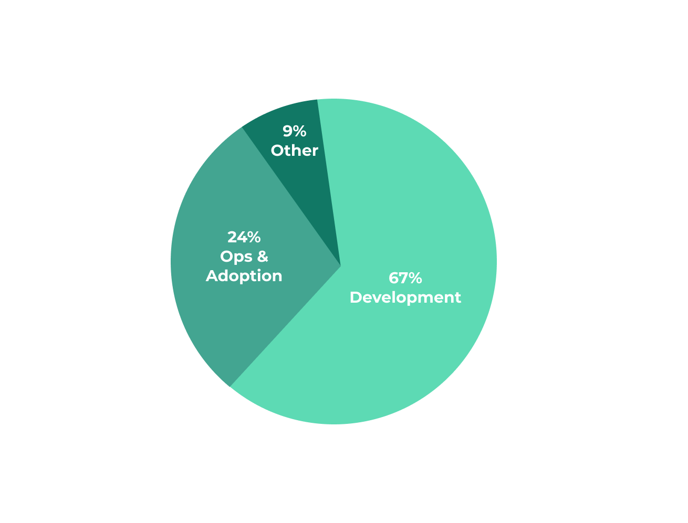
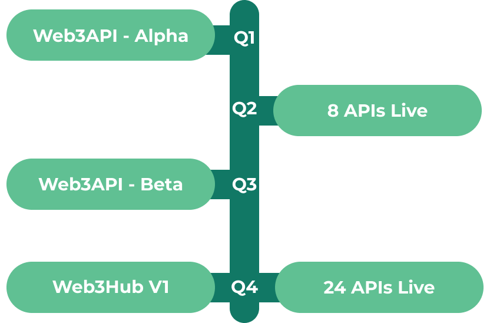

# Web3API DAO
   

The Web3API DAO is responsible for stewarding the Web3API ecosystem. `W3API` governance token holders will have immediate control of the:
- Treasury
- `W3API` token issuance
- DAO configuration
- ENS domain (web3api.eth)

In the future, it is anticipated that the DAO will also govern:
- Web3API repositories
- Web3Hub platform deployments
- DAO-verified APIs (hosted at web3api.eth subdomains)

## Getting Started

### Pre-Seed Funder

To become a *Pre-Seed Funder*:

1. Go to the [DAO's Token Request App](https://client.aragon.org/#/w3api/0x9bb4ea752a3096104c7765ad318b0f9cabaaf95f/).
2. Click **Connect Wallet** in the top right corner and select your wallet of choice (i.e. Metamask).
3. Click **New Request** below that
4. In **Offered Amount** enter the amount you would like to contribute (DAI, USDC, USDT, or TUSD).
5. In **Requested Amount** enter the **Offered Amount** divided by the current batch price (*$325*). This is the number of `W3API` you will receive.
6. Press **Create Request** to initiate the proposal and deposit your funds.
7. Fill out [this quick form](https://airtable.com/shrE0bMs1D07FV3oO).

`W3API` holders will receive this information and vote on your request. If approved, your funds will transfer to the DAO and `W3API` will be minted to your wallet. If rejected, you will be able to withdraw your funds. You may also withdraw your funds at any time before the request is approved.

### Dev Mining

To become a *Builder*:
1. Fork [web3-api/dao](https://github.com/web3-api/dao)'s `master` branch'.
2. Duplicate the [`TEMPLATE.md`](./spending-proposals/TEMPLATE.md) file in the [`./spending-proposals`](./spending-proposals) folder.
3. Name the file, complete all required fields, and feel free to get creative with anything else you'd like to add.
4. Open a PR against [web3-api/dao](https://github.com/web3-api/dao)'s `master` branch.
5. Create a proposal in the [DAO's snapshot space](https://snapshot.page/#/web3-api), linking to the open PR.
6. If the DAO proposal passes, the PR can then be merged into master.

*Builders* are granted funds and `W3API` tokens on a per-project basis by the Web3API DAO. Projects are approved ahead of time to help manage the DAO budget, maintain accountability, and schedule developments.

## Token Distribution
> NOTE: Tokens are initially set to be non-transferable.

### Pre-Seed Builders
At launch 4,000 `W3API` are minted to *Pre-Seed Builders* in proportion to work contributed before launch on October 1st (viewable [here](./token-allocations/pre-seed-builders.csv)).

### Pre-Seed Funders
4,000 `W3API` will be minted to *Pre-Seed Funders*, with a goal of raising $1M by December 31st. Tokens will be priced in three batches (viewable [here](./token-allocations/pre-seed-funders.csv))

  | Batch | Supply | Price |
  |-|-|-|
  |~~*A*~~ (filled)|~~1,500 `W3API`~~|~~$200~~|
  | *B* | 1,500 `W3API`| $250 |
  | *C* | 1,000 `W3API`| $325 |  

> NOTE: If all 4,000 `W3API` are not sold by December 31st, the remaining `W3API` *Pre-Seed Funder* allocation will be distributed pro-rata to existing *Pre-Seed Funders*.

### Dev Mining
12,000 `W3API` will be minted to *Builders* in proportion to value-added contributions over the first 16 months (~750/month). `W3API` holders will decide on further fundraising and token emission plans after the 16 month pre-seed period.

## Use of Funds

In the first 16 months, it is anticipated that the DAO will allocate funds for:
- Development - $42,000 / month
- Ops & Adoption - $15,000 / month
- Legal & SaaS - $5,500 / month

With the goal of delivering the following in 2021:

## DAO Configuration

Initial governance parameters are as follows:
| Parameter | Value | Description |
|-|-|-|
| *Minimum Approval* | 10% | Percentage of the total token supply that is required to vote “Yes” on a proposal before it can be approved. |
| *Support* | 60% | Relative percentage of tokens that are required to vote “Yes” for a proposal to be approved. |
| *Vote Duration* | 7 days| Maximum length of time that the vote will be open for participation. |

The DAO uses the following Aragon apps:
| App | Address | Description |
|-|-|-|
| *[Voting](https://help.aragon.org/article/19-voting)* | 0x5f78d0668ba666b4ed9674b313419d9db6cd48a6 | Used to create and participate in votes. Votes can be linked to an action, such as minting `W3API` or transferring funds, or be purely informative. |
| *[Finance](https://help.aragon.org/article/20-finance)* | 0xc19a9f41df38e0f01f809d257d6c71f892adaaff | Manages the organization's financial assets, including ETH and ERC20s. |
| *[Tokens](https://help.aragon.org/article/18-tokens)* | 0x8baa4cd6bf2a01e96e421c18b0231ce7791ed869 | Manages the supply and distribution of `W3API`. |
| *[Token Request](https://github.com/1Hive/token-request-app/blob/master/docs/user-guide.md)* | 0x9bb4ea752a3096104c7765ad318b0f9cabaaf95f | Mints `W3API` in exchange for payment.|
| *[Agent](https://help.aragon.org/article/37-agent)* | 0x8fe59d8fb5ffd3509e5cb3d386be8bdb2d363662 | Enables the organization to interact directly with any other smart contract on Ethereum. For example, setting an ENS resolver. |

See the full configuration [here](https://client.aragon.org/#/w3api/permissions/).

## Legal

Holders of `W3API` do not constitute any sort of partnership or joint venture, only the right to participate in the governance of the DAO. Further, becoming a Builder does not constitute any sort of partnership, joint venture, principal-agent relationship, or an employer-employee relationship. 

## FAQ

**What can I do with my `W3API` tokens?**  
Once your token request is approved, you instantly have the power to vote on all on-chain decisions, such as spending funds or minting new tokens.

**What funder protections are there?**  
1. *Pre-Seed Funders* will approach equal voting power to *Pre-Seed Builders* as the round reaches conclusion (December 31st). This means that funders can protect their own best interests through voting. 
2. Furthermore, the *Support* level is set at 60% to ensure that EVERY decision has mutual support from both builders and funders.
3. Lastly, the initial token holders are long-term committed builders (see *[Pre-Seed Builders](#Pre-Seed-Builders)* above) who have been contributing since before the project was funded.

**What about vesting?**  
`W3API` tokens are initially set to be non-transferable. The DAO can decide to change this in the future and mint tokens to contributors via timelock or vesting contracts.
